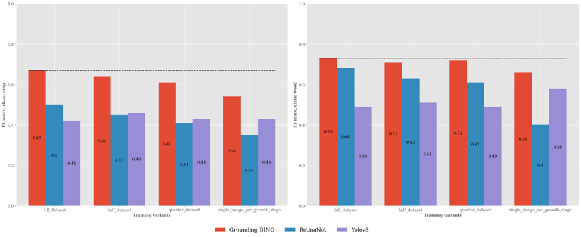
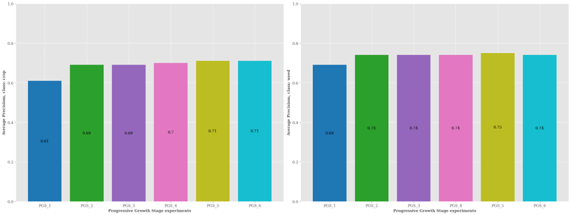
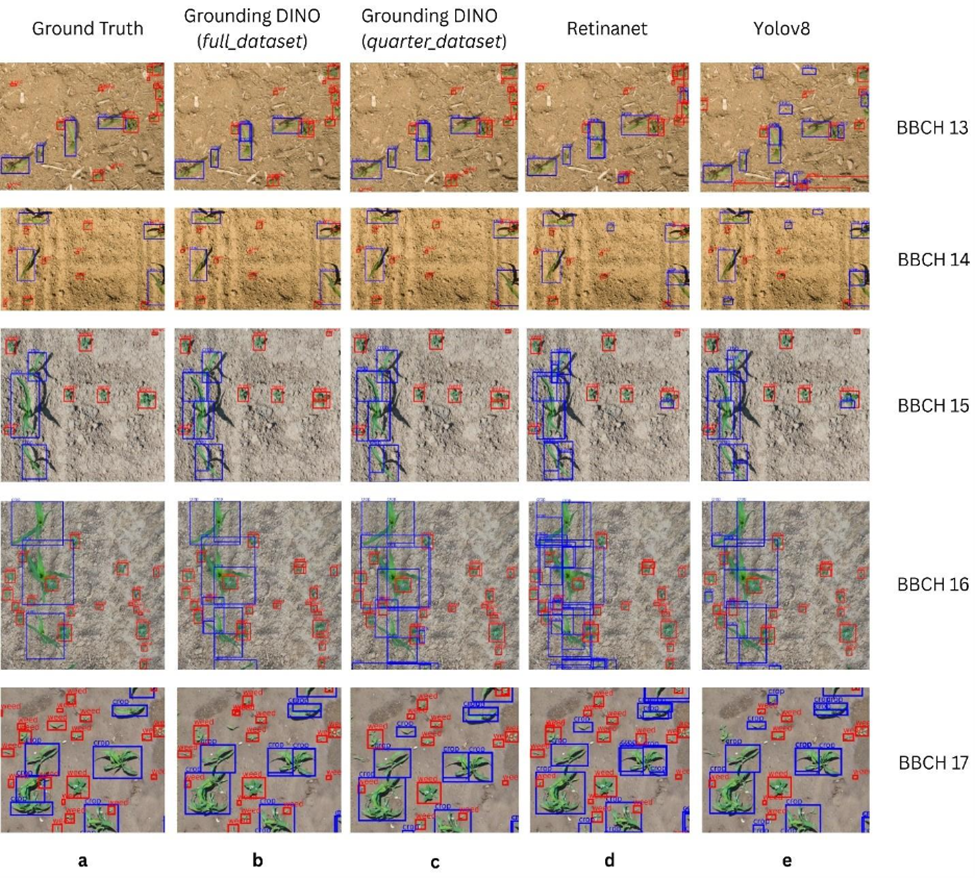

# Repository Overview
This repository contains the codebase for our research on data-efficient weed detection using Grounding DINO, a fine-tuned foundation model designed for open-set object detection in agricultural environments. The project evaluates the model’s performance under varying levels of training data availability and compares it against state-of-the-art detectors such as RetinaNet and YOLOv8. Using expert-annotated UAV imagery from sorghum and maize fields, the study demonstrates that Grounding DINO can achieve robust and accurate weed detection even when fine-tuned with only a small number of representative images per crop growth stage. The repository includes all training pipelines, experimental configurations, and evaluation scripts to enable full reproducibility and support further research in precision agriculture.

Figure 1: F1 score comparison for the class: *crop* and *weed* of our proposed Grounding DINO model with SOTA architectures across multiple training variants on the entire held-out testset.


Figure 2: F1 score comparison for the class: *crop* and *weed* of our proposed Grounding DINO model across Progressive growth stage experiments on the entire held-out testset.


Figure 3. Qualitative analysis on held-out testset. The figures consist of multiple patches from the held-out testset across crop growth stages BBCH 13 to BBCH 17 in rows, while the columns correspond to: Ground Truth annotations (a), Grounding DINO predictions from the full dataset variant (b), Grounding DINO predictions from the quarter dataset variant (c), RetinaNet predictions from the full dataset variant (d), and Yolov8 predictions from the full dataset variant (e). Predicted bounding boxes are shown for detections with confidence greater than 0.5. The comparison between (b), (d), and (e) highlights the inter-model performance of Grounding DINO, RetinaNet, and Yolov8 trained on the full dataset. While all three models identify crops and weeds with reasonable accuracy, closer inspection reveals key differences. RetinaNet and Yolov8 often generate multiple bounding boxes for the same crop instance, which are not fully suppressed under the NMS threshold of 0.5, thereby increasing False Positives (FPs) and reducing precision. Moreover, RetinaNet occasionally misclassifies weeds as crops, whereas Yolov8 exhibits this issue more frequently. Grounding DINO, in contrast, produces fewer duplicate predictions and fewer misclassifications, though some False Negatives (FNs) are observed, likely due to predictions with confidence below 0.5. The comparison between (b) and (c) illustrates the intra-model performance of Grounding DINO. Despite being trained on only 14 images (quarter_dataset) compared to 56 images (full_dataset), the predictions of the quarter dataset variant remain largely consistent with those of the full dataset. Minor differences in confidence scores suggest that reduced training data may slightly lower prediction certainty, yet detection accuracy across growth stages remains largely unaffected, underscoring the data efficiency of Grounding DINO.


## Installation

### Grounding DINO / Retinanet (MMDetection)
```
conda create -n mmdet_env python=3.10
conda activate mmdet_env

conda install pytorch torchvision -c pytorch

pip install -U openmim
pip install sympy==1.13.1 fsspec wandb optuna scikit-image
mim install mmengine
mim install "mmcv==2.1.0"


cd mmdetection
pip install -v -e .
# "-v" means verbose, or more output
# "-e" means installing a project in editable mode,
# thus any local modifications made to the code will take effect without reinstallation.

# GDino specific installations
pip install -r requirements/multimodal.txt
```


### Yolov8
```
conda create -n mmyolo_env python=3.8 pytorch==1.10.1 torchvision==0.11.2 cudatoolkit=11.3 -c pytorch -y
conda activate mmyolo_env


pip install openmim
pip install albumentations==1.3.1 wandb regex optuna
mim install "mmengine>=0.6.0"
mim install "mmcv>=2.0.0rc4,<2.1.0"
mim install "mmdet>=3.0.0,<4.0.0"

cd mmyolo
# Install albumentations
pip install -r requirements/albu.txt
# Install MMYOLO
mim install -v -e .
```

### Inference demo based on pretrained checkpoints


## Dataset preparation

1. Ensure that the cropped dataset for training, validation and testing is present in  `{mmdetection,mmyolo}/data/ewis/{train_images, val_images, test_images}/` respectively. 
2. Ensure that annotations for the images in training, validation and testset is present in .json format. For example, `{mmdetection,mmyolo}/data/ewis/{train,val,test}.json`. 
3. Additionally, include three `.txt` files listing image names for each split. For example, `{mmdetection,mmyolo}/data/ewis/{train,val,test}.txt`
4. The sample training, validation and testset required to run the training process can be found in `sample_ewis_data/`.


## Training models

1. Activate the appropriate conda environment.

```
# For Grounding DINO or Retinanet
conda activate mmdet_env

# For Yolov8
conda activate mmyolo
```

2. Train models
```
# Fine-tune Grounding DINO
python mmdetection/tools/train.py mmdetection/configs/grounding_dino/grounding_dino_swin-t_finetune_8xb2_20e_crop_weed.py

# Train Retinanet from scratch
python mmdetection/tools/train.py mmdetection/configs/retinanet/retinanet_r50_fpn_2x_coco_crop_weed.py

# Train Yolov8 from scratch
python mmyolo/tools/train.py mmyolo/configs/yolov8/yolov8_s_fast_1xb12-40e_crop_weed.py
```

## Inference on held-out testset

1. To perform inference on an image from held-out testset based on best model, update the following variables `config_path, checkpoint_path, test_image_path, pred_save_path` in the appropriate inference scripts `inference/inference_groundingDino.py` and run the below command,

```
# For inference based on fine-tuned Grounding DINO
python inference_groundingDino.py

# For inference based on trained Retinanet
python inference_retinaney.py

# For inference based on trained Yolov8
python inference_yolov8.py
```

The predictions for the test image based on all the three models is now saved in `inference/predictions` in .pt format. 

## Visualization
To visualize along with respective ground truth annotations and models for the same image, update the following variables `pred_bboxes, pred_scores, pred_labels, gt_file, test_image_path` in the script `inference/prediction_visualization.py` and run the below command,

```
python prediction_visualization.py
```
The plots are saved in `inference/visualization`
