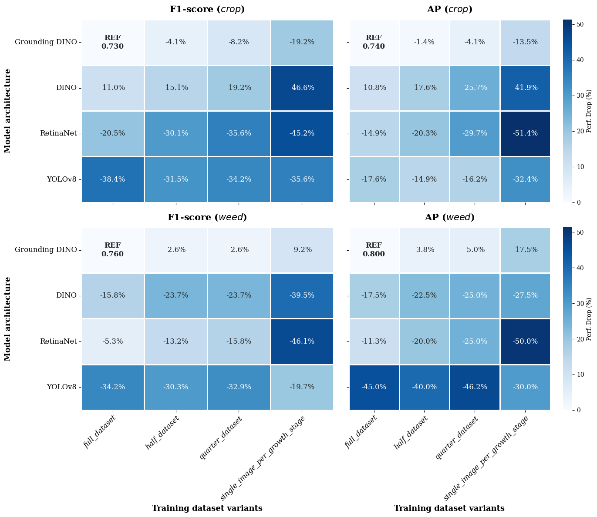
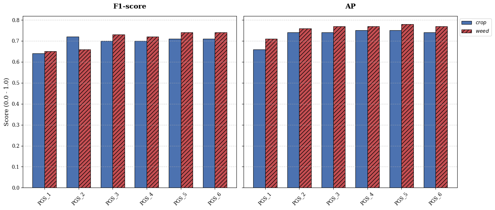

# Repository Overview
This repository contains the codebase for our research on data-efficient weed detection using Grounding DINO, a fine-tuned foundation model designed for open-set object detection in agricultural environments. The project evaluates the model’s performance under varying levels of training data availability and compares it against state-of-the-art detectors such as DINO, RetinaNet and YOLOv8. Using expert-annotated UAV imagery from sorghum and maize fields, the study demonstrates that Grounding DINO can achieve robust and accurate weed detection even when fine-tuned with only a small number of representative images per crop growth stage. The repository includes all training pipelines, experimental configurations, and evaluation scripts to enable full reproducibility and support further research in precision agriculture.

Figure 1: Comparative performance for *crop* and *weed* detection for all models and training dataset variants we consider. The values indicate the percentage performance decrease in terms of F1-score and AP relative to the best-performing model (denoted as REF) , where a darker color intensity represents a more significant performance decline.


Figure 2: F1 and AP comparison for the class: *crop* and *weed* of fine-tuned Grounding DINO model across Progressive growth stage experiments on the held-out testset.


Figure 3. Qualitative comparison of object detection performance across different architectures on a representative test sample from BBCH 13 crop growth stage. The first column illustrates the Ground Truth annotations. Subsequent columns display predictions from Grounding DINO, DINO, RetinaNet, and YOLOv8. The top panel depicts results for models trained on the *full_dataset*, while the bottom panel shows performance for the *quarter_dataset* variant. Blue bounding boxes denote *crop* instances, and red bounding boxes indicate *weed* species. 


Figure 4. Qualitative comparison of object detection performance across different architectures on a representative test sample from BBCH 15 crop growth stage. The first column illustrates the Ground Truth annotations. Subsequent columns display predictions from Grounding DINO, DINO, RetinaNet, and YOLOv8. The top panel depicts results for models trained on the *full_dataset*, while the bottom panel shows performance for the *quarter_dataset* variant. Blue bounding boxes denote *crop* instances, and red bounding boxes indicate *weed* species.


## Installation

### Grounding DINO / Retinanet (MMDetection)
```
conda create -n mmdet_env python=3.10
conda activate mmdet_env

conda install pytorch torchvision -c pytorch

pip install -U openmim
pip install sympy==1.13.1 fsspec wandb optuna scikit-image
mim install mmengine
mim install "mmcv==2.1.0"


cd mmdetection
pip install -v -e .
# "-v" means verbose, or more output
# "-e" means installing a project in editable mode,
# thus any local modifications made to the code will take effect without reinstallation.

# GDino specific installations
pip install -r requirements/multimodal.txt
```


### Yolov8
```
conda create -n mmyolo_env python=3.8 pytorch==1.10.1 torchvision==0.11.2 cudatoolkit=11.3 -c pytorch -y
conda activate mmyolo_env


pip install openmim
pip install albumentations==1.3.1 wandb regex optuna
mim install "mmengine>=0.6.0"
mim install "mmcv>=2.0.0rc4,<2.1.0"
mim install "mmdet>=3.0.0,<4.0.0"

cd mmyolo
# Install albumentations
pip install -r requirements/albu.txt
# Install MMYOLO
mim install -v -e .
```

## Inference demo based on pretrained checkpoints
Follow the instructions provided in the inference demo notebook to run inference on test image based on pre-trained checkpoints. The checkpoints are downloaded from Huggingface space. The demo notebook can be found here `inference/demo_inference_notebook.ipynb` 


## Dataset preparation

1. Ensure that the cropped dataset for training, validation and testing is present in  `{mmdetection,mmyolo}/data/ewis/{train_images, val_images, test_images}/` respectively. 
2. Ensure that annotations for the images in training, validation and testset is present in .json format. For example, `{mmdetection,mmyolo}/data/ewis/{train,val,test}.json`. 
3. Additionally, include three `.txt` files listing image names for each split. For example, `{mmdetection,mmyolo}/data/ewis/{train,val,test}.txt`
4. The sample training, validation and testset required to run the training process can be found in `sample_ewis_data/`.


## Training models

1. Activate the appropriate conda environment.

```
# For Grounding DINO, DINO and RetinaNet
conda activate mmdet_env

# For YOLOv8
conda activate mmyolo
```

2. Train models (on full_dataset training dataset variant)
```
# Fine-tune Grounding DINO 
python mmdetection/tools/train.py mmdetection/configs/grounding_dino/gd_full_dataset.py

# Train DINO 
python mmdetection/tools/train.py mmdetection/configs/dino/dino_full_dataset.py

# Train Retinanet
python mmdetection/tools/train.py mmdetection/configs/retinanet/rn_full_dataset.py

# Train YOLOv8
python mmyolo/tools/train.py mmyolo/configs/yolov8/yolov8_full_dataset.py
```

## Inference on held-out testset

1. To perform inference on an image from held-out testset based on best model, update the following variables `config_path, checkpoint_path, test_image_path, pred_save_path` in the appropriate inference scripts `inference/inference_groundingDino.py` and run the below command,

```
# For inference based on fine-tuned Grounding DINO
python inference_groundingDino.py

# For inference based on trained Retinanet
python inference_retinanet.py

# For inference based on trained Yolov8
python inference_yolov8.py
```

The predictions for the test image based on all the three models is now saved in `inference/predictions` in .pt format. 

## Visualization
To visualize along with respective ground truth annotations and models for the same image, update the following variables `pred_bboxes, pred_scores, pred_labels, gt_file, test_image_path` in the script `inference/prediction_visualization.py` and run the below command,

```
python prediction_visualization.py
```
The plots are saved in `inference/visualization`
